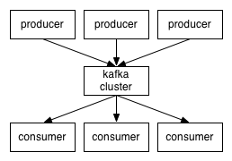
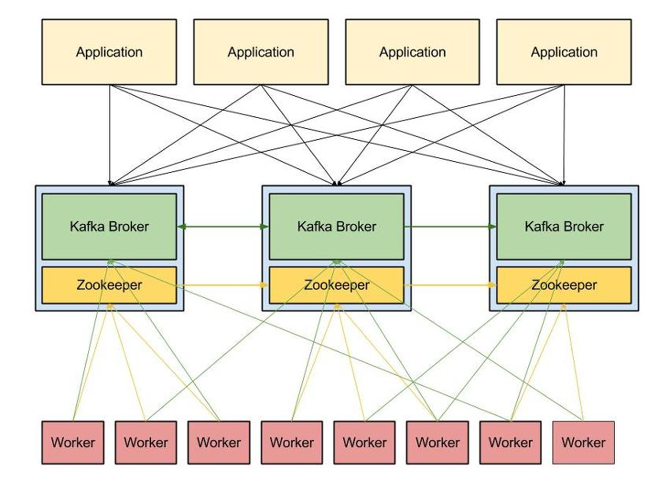
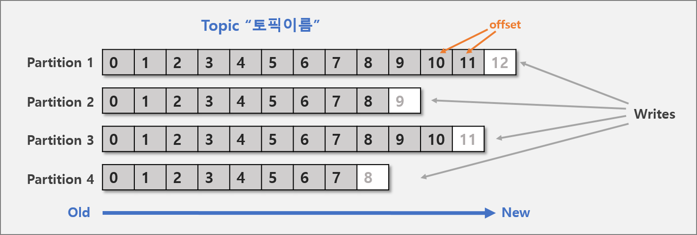
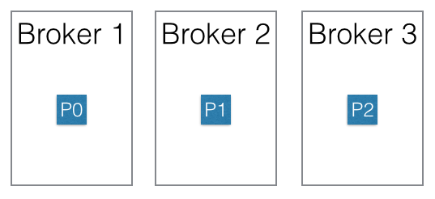
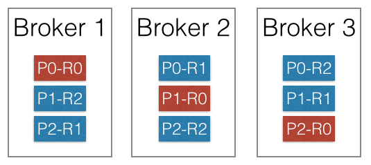
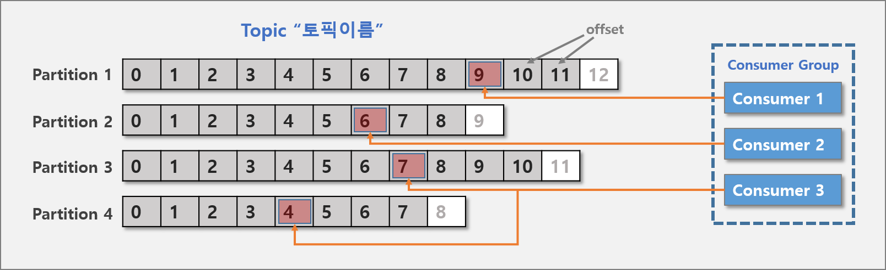
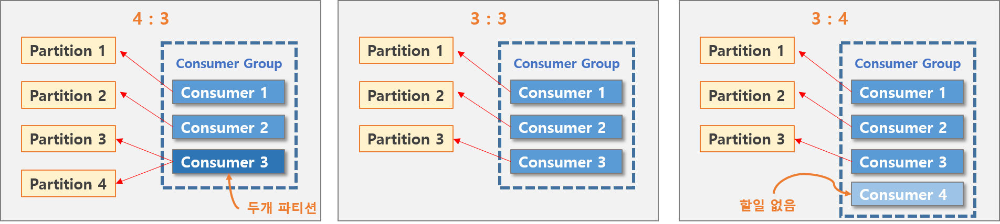

### KAFKA

**카프카란?** 

분산형 스트리밍 플랫폼(A distributed streaming platform)이다. LinkedIn에서 여러 구직 및 채용 정보들을 한곳에서 처리(발행/구독)할 수 있는 플래폼으로 개발이 시작 되었다고 한다.

**Kafka의 기본 구성 요소와 동작**

* Kafka는 **발행-구독(public-subscribe) 모델**을 기반으로 동작하며, 크게 **producer, consumer, broker** 로 구성

  

  

* Kafka의 broker는 topic을 기준으로 메시지를 관리한다. Producer는 특정 topic의 메시지를 생성한 뒤 해당 메시지를 broker에 전달한다. Broker가 전달 받은 메시지를 topic 별로 분류하여 쌓아놓으면, 해당 topic을 구독하는 consumer들이 메시지를 가져가서 처리하게 된다.

* Kafka는 **확장성(scale-out)**과 **고가용성(high avialabilty)**를 위하여 broker들이 클러스터로 구성되어 동작하도록 설계되어 있다. 심지어 **broker가 1개 밖에 없을 때에도 클러스터로써 동작**한다. 클러스터 내의 broker에 대한 분산 처리는 아래 그림과 같이 Apache Zookeeper가 담당한다.

  

  #### Topic & Partition

  *  카프카에 저장되는 메시지는 topic으로 분류되고, topic은 여러개의 patition으로 나눠질수 있다. partition안에는 message의 상대적 위치를 내타내는 offset이 있는데 이 **offet정보를 이용해 이전에 가져간 메시지의 위치 정보를 알 수 있고** 동시에 들어오는 **많은 데이터를 여러개의 파티션에 나누어 저장하기 때문에 병렬로 빠르게 처리**할 수 있다.

    

  ### Partition의 분산

  

  * 위의 그림에서는 3개의 broker로 이루어진 클러스터에서 하나의 topic이 3개의 partition P0, P1, P2로 분산되어 저장되어 있다. **Producer가 메시지를 실제로** **어떤 partition으로 전송할지는 사용자가 구현한 partition 분배 알고리즘에 의해 결정**된다. 예를 들어 라운드-로빈 방식의 partition 분배 알고리즘을 구현하여 각 partition에 메시지를 균들하게 분배하도록 하거나, 메시지의 키를 활용하여 알바벳 A로 시작하는 키를 가진 메시지는 P0에만 전송하고, B로 시작하는 키를 가진 메시지는 P1에만 전송하는 형태의 구성도 가능하다.

  ### Partition 복제

  * Kafka에서는 **고가용성을 위하여 각 Partition을 복제하여 클러스터에 분산**시킬 수 있다. 아래의 그림은 해당 topic의 replication factor를 3으로 설정한 클러스터이다. 각 partition 들은 3개의 relica를 가지며 각 replica는 R0, R1, R2로 표시되어 있다.

  

  * Replication factor를 N으로 설정할 경우, N개의 replica는 1개의 leader와 N-1개의 follower로 구성된다. 위의 그림에서는 각 partition 마다 하나의 leader(붉은색)가 존재하며 2개의 follower(푸른색)가 존재한다.
  * 각 **partition에 대한 읽기와 쓰기는 모두 leader**에서 이루어지며, **follower는 단순히 leader를 복제**하기만 한다. 만약 **leader에 장애가 발생**할 경우 **follower 중 하나가 새로운 leader**가 된다. Kafka의 복제모델인 ISR 모델은 f+1 개의 replica 를 가진 topic이 f개의 장애까지 버틸 수 있다고 한다.

  

  #### Producer, Consumer

  * Producer에서 생산(Write)한 메시지는 여러개의 파티션에 저장을 하는데, 그렇다면 소비하는(Consumer)하는 쪽에서도 여러 소비자가 메시지를 읽어가는것이 훨씬 효율적일 것이다. 하나의 목표를 위해 소비를 하는 그룹, 즉 하나의 토픽을 읽어가기 위한 Counsumer들을 Consumer Group라고 한다.

  #### Consumer Group

  * Producer에서 생산(Write)한 메시지는 여러개의 파티션에 저장을 하는데, 그렇다면 소비하는(Consumer)하는 쪽에서도 여러 소비자가 메시지를 읽어가는것이 훨씬 효율적일 것이다. 하나의 목표를 위해 소비를 하는 그룹, 즉 하나의 토픽을 읽어가기 위한 Counsumer들을 Consumer Group라고 한다.

  * 하지만 이 Consumer Group에는 한가지 룰이 있다. Topic의 파티션은 그 Consumer Group과 1:n 매칭. 즉, 자신이 읽고 있는 파티션에는 같은 그룹내 다른 컨슈머가 읽을 수 없다. 

    

  

  * 카프카에서는 Consumer 그룹이라는 개념이 나온다. 말 그대로 consumer들의 묶음이고, 기본적인 룰이 하나가 존재한다. **반드시 해당 topic의 파티션은 그 consumer group과 1:n 매칭을 해야한다.** 그렇기 때문에 아래의 경우가 존재한다.

  case1) partiton 3 :consumer 2 = consumer 중에 하나는 2개의 파티션을 소비

  case2) partiton 3: consumer 3 = consumer 1개랑 파티션1나랑 1:1매칭

  case3) partiton 3: consumer 4 = consumer 1개가 아무것도 하지 않음

  

  

 